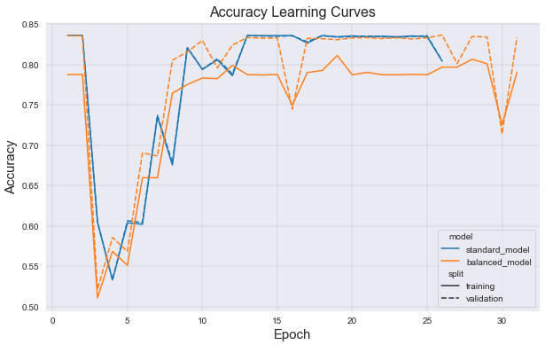
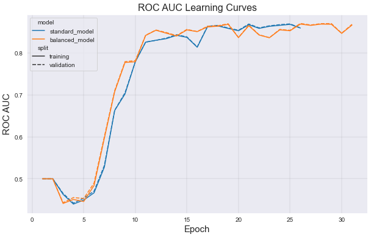
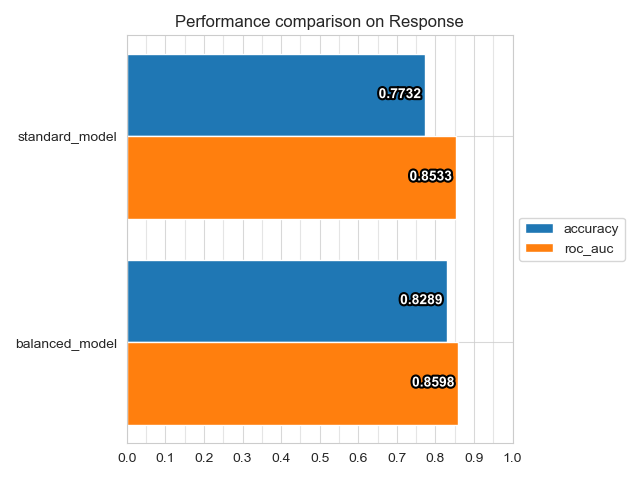

# Credit Card Fraud Detection Example

This API example is based on Kaggle's [Imbalanced Insurance](https://www.kaggle.com/arashnic/imbalanced-data-practice) dataset for detecting whether customers will buy vehicle insurance.

### Preparatory Steps

Create and download your [Kaggle API Credentials](https://github.com/Kaggle/kaggle-api#api-credentials).

The Imbalanced Insurance dataset is hosted by Kaggle, and as such Ludwig will need to authenticate you through the Kaggle API to download the dataset.

### Examples

| File                         | Description                                                                                                    |
|------------------------------|----------------------------------------------------------------------------------------------------------------|
| model_training.py            | Demonstrates the use of oversampling by training two different models: one with no oversampling, and one with. |
| model_training_results.ipynb | Example for extracting training statistics and generate visualizations.                                        |

Enter `python model_training.py` will train a standard model with no class balancing and a balanced model with class balancing applied.  Results of model training will be stored in this location.

```
./results/
    balance_example_standard_model/
    balance_example_balanced_model/
```

The only difference between these two models is that the balanced model uses a small amount of oversampling in addition to the other configuration parameters. 
The way this is done is by specifying the ratio that you want the minority class to have in relation to the majority class. 
For instance, if you specify 0.5 for the `oversample_minority` preprocessing parameter, then the minority class will be oversampled until it makes up 50% of the majority class. 
In this example, we had imbalance where the minority class was 19% of the majority class in size. We decided that we wanted to increase that to 26%. 
Though this doesn't seem like much it is enough to get some small performance improvements without experiencing performance degradation due to over-fitting. 

Here are the performance differences in the two models followed by some plots showing different metrics over training:

|  Metric  | Standard Model | Balanced Model |
|:--------:|:--------------:|:--------------:|
|   Loss   |     0.3649     |     0.2758     |
| Accuracy |     0.7732     |     0.8237     |
| ROC AUC  |     0.8533     |     0.8660     |

Here are the learning curve plots from both models:





Here is the comparison of model performances on ROC_AUC and Accuracy:



The creation of the learning curves is demonstrated in the Jupyter notebook `model_training_results.ipynb`. The comparison plot was generated using the ludwig visualize [compare performance](https://ludwig-ai.github.io/ludwig-docs/0.4/user_guide/visualizations/#compare-performance) command.